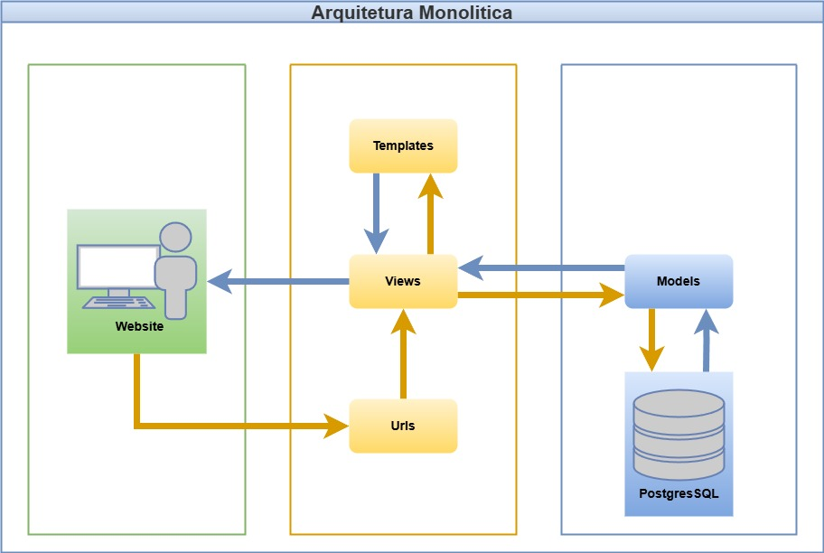

# Projeto Arquitetural do Software

Documento construído a partido do **Modelo BSI - Doc 005 - Documento de Projeto Arquitetual do Software** que pode ser encontrado no
link:https://docs.google.com/document/d/1i80vPaInPi5lSpI7rk4QExnO86iEmrsHBfmYRy6RDSM/edit?usp=sharing

## Descrição da Arquitetura do Projeto

Este diagrama representa a arquitetura do sistema desenvolvido com Django, seguindo o padrão MVT (Model-View-Template) e mantendo uma estrutura monolítica, onde o backend se comunica diretamente com o banco de dados e renderiza templates para o frontend.
## Visão Geral da Arquitetura

Imagem com a organização geral dos componentes da arquitetura do projeto. Segue um exemplo da **Arquitetura Geral** de um Projeto usando **Django Framework**:

## Requisitos Não-Funcionais

| Requisito        | Detalhes |
|------------------|----------|
| **Desempenho**   | 1. O sistema deve ser capaz de processar transações e atualizar o estoque em tempo real para garantir a precisão dos dados.   **Prioridade**: Essencial |
| **Segurança**    | 1. O sistema deve implementar autenticação de usuários com senhas criptografadas.   2. Permissões de acesso devem ser aplicadas para proteger informações sensíveis dos fornecedores.   **Prioridade**: Essencial |
| **Usabilidade**  | 1. O sistema deve possuir uma interface intuitiva e fácil de navegar.   2. Recursos de ajuda devem estar disponíveis para os usuários.   **Prioridade**: Importante |
| **Confiabilidade** | 1. O sistema deve estar disponível durante o horário de funcionamento da ótica.   2. Deve haver um plano de recuperação de desastres para garantir a continuidade dos negócios em caso de falha.   **Prioridade**: Essencial |

## Dependências

| Dependência              | Descrição |
|--------------------------|-----------|
| **Software**              | O sistema requer um sistema operacional atualizado. Pode ser necessário software adicional para visualização de relatórios e gráficos. |
| **Conexão com a Internet**| Uma conexão estável é necessária para atualizações, suporte técnico e comunicação com fornecedores. |

## Mecanismos Arquiteturais

Nesta seção, são listados os mecanismos arquiteturais adotados no sistema, abrangendo mecanismos de análise, design e implementação. O objetivo é garantir que todas as preocupações técnicas relevantes à arquitetura tenham sido devidamente contempladas.

| Mecanismo de Análise | Mecanismo de Design     | Mecanismo de Implementação               |
|----------------------|-------------------------|------------------------------------------|
| Persistência         | Banco de dados relacional| PostgreSQL 16                            |
| Camada de Dados      | Mapeamento Objeto-Relacional (OR) | Django ORM                      |
| Frontend             | Interface com o Usuário | Django Templates, HTML5, CSS3, JS, Bootstrap 5 |
| Backend              | Lógica de Negócio       | Django        |
| Build                | Empacotamento           | Docker, Dockerfile                       |
| Deploy               | Containerização         | Docker Compose                           |

# Implantação

Durante a fase de desenvolvimento, o sistema será executado localmente pelos integrantes da equipe, o que facilita a configuração entre os membros da equipe. Ao final do desenvolvimento, será avaliada a utilização de uma plataforma de hospedagem gratuita para implantação do sistema, visando garantir acesso remoto à aplicação sem custos adicionais. A escolha da plataforma considerará critérios como suporte a contêineres, compatibilidade com Django e facilidade de manutenção.
