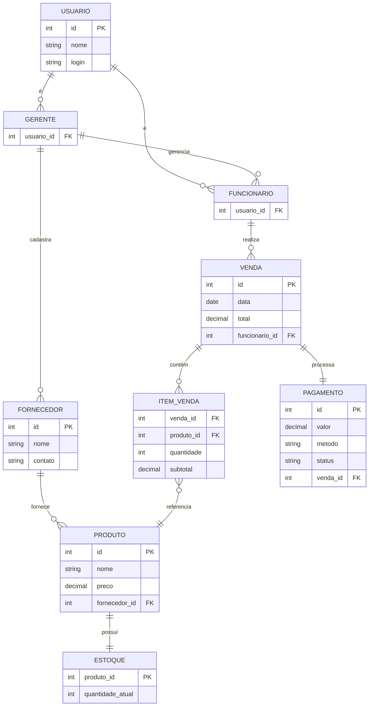
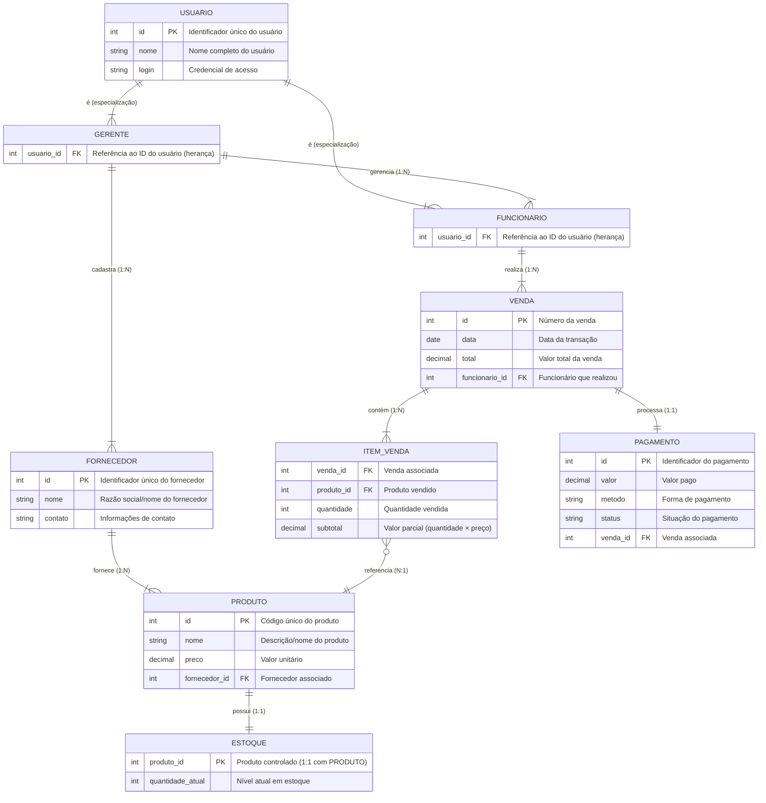

### Modelo Conceitual

Abaixo apresentamos o modelo conceitual usando o **Mermaid**.

# Principais Características do Modelo Conceitual

## 1. Estrutura de Usuários
- **Herança (Specialização/Generalização)**:
  - `USUARIO` como entidade pai (superclasse)
  - `GERENTE` e `FUNCIONARIO` como entidades filhas (subclasses)
  - Implementado via chave estrangeira (`usuario_id`)

## 2. Relacionamentos Hierárquicos
- **Gerência**:
  - `GERENTE` → `FUNCIONARIO` (1:N)
- **Cadastro**:
  - `GERENTE` → `FORNECEDOR` (1:N)

## 3. Cadeia de Suprimentos
- **Fornecimento**:
  - `FORNECEDOR` → `PRODUTO` (1:N)
- **Controle de Estoque**:
  - `ESTOQUE` → `PRODUTO` (1:1)

## 4. Processo de Vendas
- **Operacional**:
  - `FUNCIONARIO` → `VENDA` (1:N)
- **Composição**:
  - `VENDA` → `ITEM_VENDA` (1:N)
  - `ITEM_VENDA` → `PRODUTO` (N:1)

## 5. Transações Financeiras
- **Pagamento**:
  - `VENDA` → `PAGAMENTO` (1:1)

## 6. Atributos e Identificadores
| Entidade       | PK    | Atributos Relevantes               | FK              |
|----------------|-------|------------------------------------|-----------------|
| USUARIO        | id    | nome, login                        | -               |
| GERENTE        | -     | -                                  | usuario_id      |
| FUNCIONARIO    | -     | -                                  | usuario_id      |
| FORNECEDOR     | id    | nome, contato                      | -               |
| PRODUTO        | id    | nome, preço                        | fornecedor_id   |
| ESTOQUE        | -     | quantidade_atual                   | produto_id      |
| VENDA          | id    | data, total                        | funcionario_id  |
| ITEM_VENDA     | -     | quantidade, subtotal               | venda_id, produto_id |
| PAGAMENTO      | id    | valor, método, status              | venda_id        |

## 7. Integridade e Normalização
- **Chaves Primárias**: Todas as entidades possuem identificadores únicos
- **Chaves Estrangeiras**: Todos os relacionamentos são devidamente implementados
- **Cardinalidades**: Especificadas corretamente para cada relacionamento
- **Ausência de Redundância**: Dados não duplicados entre entidades

## 8. Tipos de Dados
- **Numéricos**: `int` para IDs e quantidades, `decimal` para valores monetários
- **Textuais**: `string` para nomes e descrições
- **Temporais**: `date` para registro de datas

## 9. Modelagem de Negócios
- **Controle de Acesso**: Distinção clara entre gerentes e funcionários
- **Gestão de Inventário**: Controle de estoque vinculado a produtos
- **Processo Completo de Venda**: Desde o cadastro até o pagamento

### Modelo de Entidade Relacionamento ER

# Principais Características do Modelo Entidade-Relacionamento (MER)

## Estrutura Básica
- **Entidades Principais**: USUARIO, GERENTE, FUNCIONARIO, FORNECEDOR, PRODUTO, VENDA, ITEM_VENDA, PAGAMENTO, ESTOQUE  
- **Relacionamentos**: Especialização (herança), associações 1:N e N:1, composição (Venda-Itens), controle 1:1 entre PRODUTO e ESTOQUE  
- **Cardinalidades**: Claramente definidas (ex: 1:1, 1:N, N:1)  

---

## Chaves e Identificadores
- **PK (Primary Key)**: Todas as entidades possuem ID único (ex: `USUARIO.id`, `VENDA.id`)  
- **FK (Foreign Key)**: Relacionamentos implementados via chaves estrangeiras (ex: `FUNCIONARIO.usuario_id` referencia `USUARIO.id`)  

---

## Hierarquia e Herança
- **Generalização (USUARIO)**:  
  - Especializações: `GERENTE` e `FUNCIONARIO` herdam atributos de `USUARIO` via FK.  
- **Papéis Distintos**:  
  - Gerente: Gerencia funcionários e cadastra fornecedores.  
  - Funcionário: Realiza vendas.  

---

## Fluxo de Vendas
1. **VENDA**:  
   - Realizada por `FUNCIONARIO`.  
   - Contém múltiplos `ITEM_VENDA` (com quantidade e subtotal).  
2. **PRODUTO**:  
   - Vinculado a `FORNECEDOR`.  
   - Referenciado em `ITEM_VENDA`.  
   - Associado a `ESTOQUE` (controle separado da quantidade).  
3. **PAGAMENTO**:  
   - Relação 1:1 com `VENDA` (valor, método, status).  

---

## Gestão de Estoque e Fornecedores
- **FORNECEDOR**: Cadastrado por `GERENTE`, fornece `PRODUTO`.  
- **ESTOQUE**:  
  - Monitora a `quantidade_atual` de cada `PRODUTO`.  
  - Relação 1:1 com `PRODUTO`.  
  - A entidade `PRODUTO` **não possui mais o atributo `quantidade`**, que agora é controlado exclusivamente pela entidade `ESTOQUE`.  

---

## Integridade Referencial
- **Dependências**:  
  - Exclusão de `USUARIO` deve afetar `GERENTE`/`FUNCIONARIO`.  
  - `ITEM_VENDA` depende de `VENDA` e `PRODUTO`.  
  - `ESTOQUE` depende de `PRODUTO`.  
- **Atributos Obrigatórios**:  
  - Todos os IDs (PK/FK) são `NOT NULL`.  
  - `quantidade_atual` em `ESTOQUE` deve ser maior ou igual a zero.  

---

## Tipos de Dados
- **Numéricos**: IDs (`int`), quantidades (`int`), valores monetários (`decimal`).  
- **Textos**: Nomes (`string`), método de pagamento (`string`).  
- **Datas**: `VENDA.data` como `date`.  

---

## Destaques:
- **Performance**: Separação de responsabilidades entre `PRODUTO` e `ESTOQUE` melhora a organização e eficiência nas operações.  
- **Segurança**: Herança garante controle de acesso (gerente vs funcionário).  
- **Escalabilidade**: Modelo preparado para novas operações no estoque, como entrada, venda, cancelamento e correções.  

  
