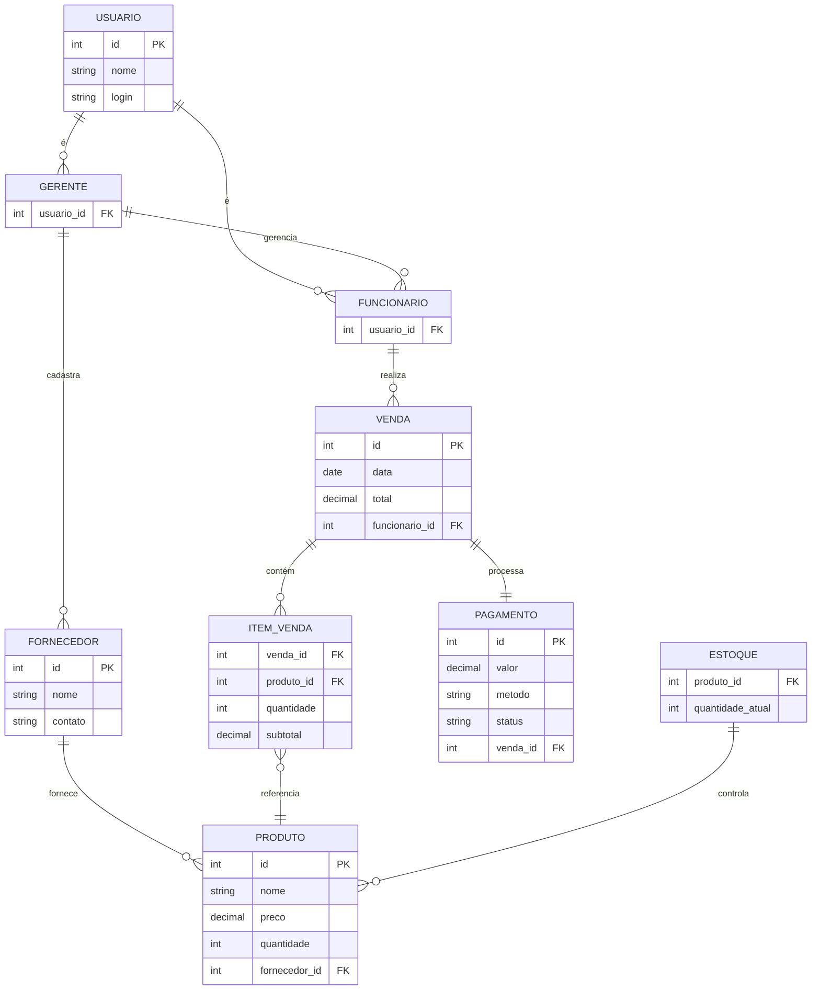

## Descrição do Projeto

O sistema de controle de estoque para ótica tem como objetivo otimizar a gestão do estoque, controlando bem a entrada e a saída de produtos como, por exemplo: armações, lentes e óculos de sol. Esse sistema permite o monitoramento em tempo real do estoque, facilitando muito a organização e também a reposição das mercadorias. Esse sistema também oferece funcionalidades para registrar vendas, acompanhar transações e gerar relatórios detalhados, garantindo uma gestão mais precisa.

Benefícios do Sistema:

 -Controle de Estoque em Tempo Real: Monitoramento da disponibilidade dos produtos.

 -Gestão de Vendas Eficiente: Registro seguro das transações realizadas.

 -Relatórios Detalhados: Emissão de relatórios sobre estoque e vendas.

 -Segurança e Acesso Controlado: Definição de permissões conforme o papel do usuário.

 -Interface Simples: Facilidade de uso para todos os perfis de usuário.

## Equipe e Definição de Papéis

Membro     |     Papel   |   E-mail   |
---------  | ----------- | ---------- |
Cayo | Analista  | cayo.lopes.129@ufrn.edu.br
Gabriel Gomes | Analista | gabriel.gomes.710@ufrn.edu.br
Gustavo | Primeiro Líder Técnico | gustavo.cruz.133@ufrn.edu.br
Joyce | Analista | joyce.santos.709@ufrn.edu.br
Taciano | Cliente/Professor | tacianosilva@gmail.com
Arthur | Cliente | stegelemon.com.br@gmail.com

## Perfis dos Usuários  
O sistema poderá ser utilizado por dois usuários. Temos os seguintes perfis:

**Perfil Funcionário**  
O perfil funcionário irá utilizar o sistema para visualizar estoque, realizar vendas e realizar pagamentos.

**Perfil Gerente**  
Este usuário tem acesso a todas as funcionalidades do sistema, exemplos: cadastrar e editar informações de produtos, funcionários  e fornecedores, registrar entradas e saídas de produtos.

## Matriz de Competências  
| Nome         | Competências                                        |
|--------------|----------------------------------------------------|
| Cayo César  | Desenvolvedor Python, C, Dart e Web. Com habilidades na área de gestão de equipe e projetos |
| Gabriel Gomes | Desenvolvedor Python, C, Dart e Web. Com habilidades na área de gestão de equipe e projetos |
| Gustavo Douglas | Desenvolvedor Python, C, Dart e Web. Com habilidades na área de gestão de equipe e projetos |
| Joyce Oliveira | Desenvolvedor Python, C, Dart e Web. Com habilidades na área de gestão de equipe e projetos |

### Modelo Conceitual

Abaixo apresentamos o modelo conceitual usando o **Mermaid**.

