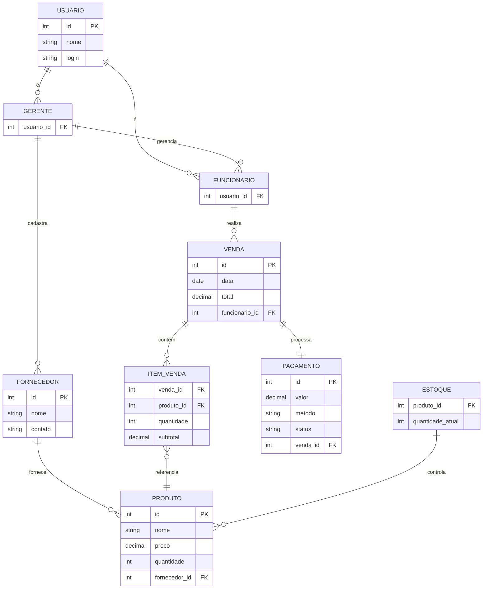

### Modelo Conceitual

Abaixo apresentamos o modelo conceitual usando o **Mermaid**.

```mermaid
erDiagram
    USUARIO ||--o{ GERENTE : "é"
    USUARIO ||--o{ FUNCIONARIO : "é"
    GERENTE ||--o{ FUNCIONARIO : "gerencia"
    GERENTE ||--o{ FORNECEDOR : "cadastra"
    FORNECEDOR ||--o{ PRODUTO : "fornece"
    FUNCIONARIO ||--o{ VENDA : "realiza"
    VENDA ||--o{ ITEM_VENDA : "contém"
    ITEM_VENDA }o--|| PRODUTO : "referencia"
    VENDA ||--|| PAGAMENTO : "processa"
    ESTOQUE ||--o{ PRODUTO : "controla"

    USUARIO {
        int id PK
        string nome
        string login
    }

    GERENTE {
        int usuario_id FK
    }

    FUNCIONARIO {
        int usuario_id FK
    }

    FORNECEDOR {
        int id PK
        string nome
        string contato
    }

    PRODUTO {
        int id PK
        string nome
        decimal preco
        int quantidade
        int fornecedor_id FK
    }

    ESTOQUE {
        int produto_id FK
        int quantidade_atual
    }

    VENDA {
        int id PK
        date data
        decimal total
        int funcionario_id FK
    }

    ITEM_VENDA {
        int venda_id FK
        int produto_id FK
        int quantidade
        decimal subtotal
    }

    PAGAMENTO {
        int id PK
        decimal valor
        string metodo
        string status
        int venda_id FK
    }
```
