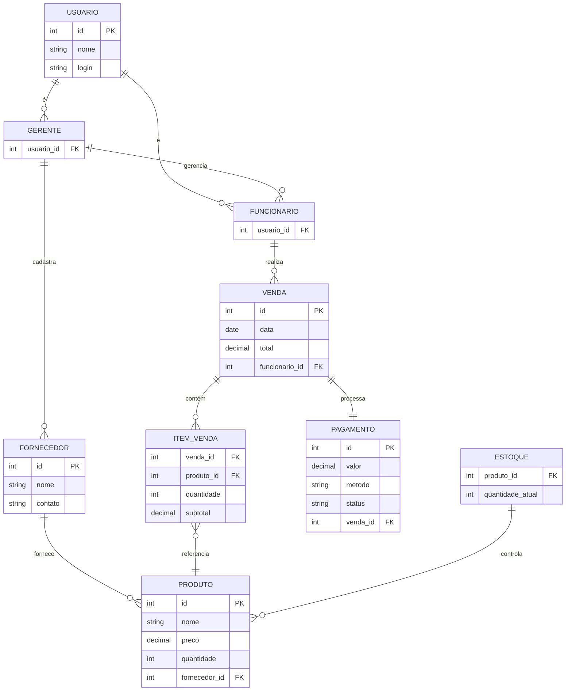

# Sistema de Controle de Estoque para Ótica  

## Descrição do Projeto  
O sistema de controle de estoque para ótica tem como objetivo otimizar a gestão do estoque, controlando a entrada e saída de produtos (armações, lentes, óculos de sol). Oferece:  

- **Controle em tempo real** do estoque  
- **Registro de vendas** e transações  
- **Relatórios detalhados**  
- **Acesso seguro** por perfil de usuário  
- **Interface intuitiva**  

## Equipe  

| Membro            | Papel                   | E-mail                          |
|-------------------|-------------------------|---------------------------------|
| Cayo César        | Analista                | cayo.lopes.129@ufrn.edu.br      |
| Gabriel Gomes     | Analista                | gabriel.gomes.710@ufrn.edu.br   |
| Gustavo Douglas   | Líder Técnico           | gustavo.cruz.133@ufrn.edu.br    |
| Joyce Oliveira    | Analista                | joyce.santos.709@ufrn.edu.br    |
| Taciano Silva     | Cliente/Professor       | tacianosilva@gmail.com          |
| Arthur            | Cliente                 | stegelemon.com.br@gmail.com     |

## Perfis de Usuários  

### Funcionário  
- Visualizar estoque  
- Registrar vendas  
- Emitir comprovantes  

### Gerente  
- Gerenciar produtos, funcionários e fornecedores  
- Acessar relatórios  
- Controlar permissões  

## Requisitos Funcionais  

### US01 - Manter Funcionário  
| Código       | Descrição                          | Ator      |
|--------------|------------------------------------|-----------|
| RF01.01      | Cadastrar novo funcionário         | Gerente   |
| RF01.02      | Listar funcionários com filtros    | Gerente   |

### US02 - Manter Fornecedor  
| Código       | Descrição                          | Ator      |
|--------------|------------------------------------|-----------|
| RF02.01      | Cadastrar novo fornecedor          | Gerente   |

### US03 - Manter Produto  
| Código       | Descrição                          | Ator      |
|--------------|------------------------------------|-----------|
| RF03.01      | Cadastrar novo produto             | Gerente   |

## Requisitos Não Funcionais  

| Código  | Categoria      | Descrição                              | Prioridade |
|---------|----------------|----------------------------------------|------------|
| RNF01   | Desempenho     | Atualização de estoque em tempo real   | Alta       |
| RNF02   | Segurança      | Autenticação de usuários               | Crítica    |

### Modelo Conceitual

Abaixo apresentamos o modelo conceitual usando o **Mermaid**.

