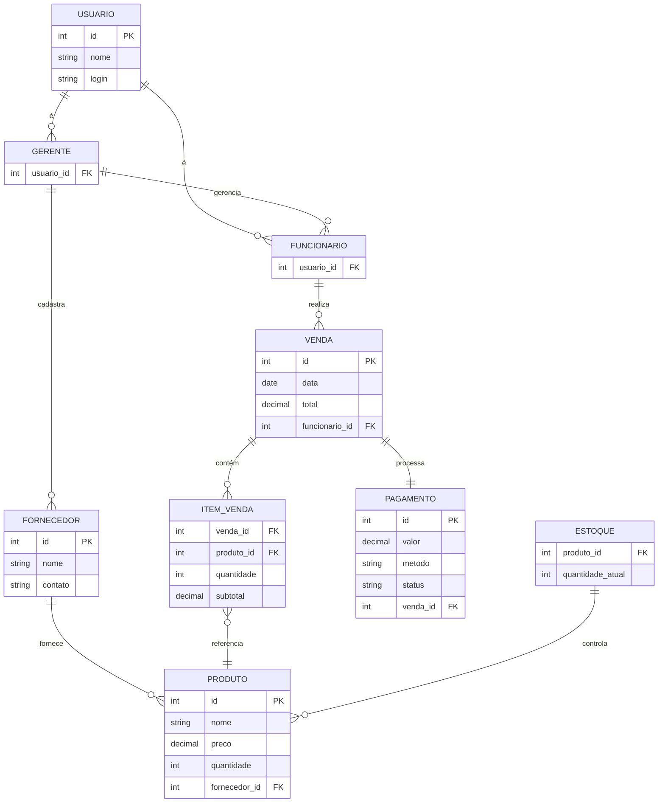

# Requisitos Funcionais

## Entidade Funcionário - US01 - Manter Funcionário

Um funcionário possui nome, cargo e informações de contato.

| Requisito  | Descrição                                                                                          | Ator          |
|------------|----------------------------------------------------------------------------------------------------|--------------|
| RF01.01 - Inserir Funcionário | Insere novo funcionário informando: nome, cargo e contato.                           | Gerente      |
| RF01.02 - Listar Funcionários | Listagem dos funcionários utilizando filtros nos atributos: nome, cargo e contato. | Gerente      |
| RF01.03 - Atualizar Funcionário | Atualiza um funcionário informando: nome, cargo e contato.                         | Gerente      |
| RF01.04 - Deletar Funcionário | Deleta um funcionário informando o identificador único.                           | Gerente      |

---

## Entidade Fornecedor - US02 - Manter Fornecedor

Um fornecedor possui nome e informações de contato.

| Requisito  | Descrição                                                                                   | Ator          |
|------------|---------------------------------------------------------------------------------------------|--------------|
| RF02.01 - Inserir Fornecedor | Insere novo fornecedor informando: nome e contato.                           | Gerente      |
| RF02.02 - Listar Fornecedores | Listagem de fornecedores utilizando filtros nos atributos: nome e contato.    | Gerente      |
| RF02.03 - Atualizar Fornecedor | Atualiza um fornecedor informando: nome e contato.                          | Gerente      |
| RF02.04 - Deletar Fornecedor | Deleta um fornecedor informando o identificador único.                      | Gerente      |

---

## Entidade Produto - US03 - Manter Produto

Um produto possui nome, preço e quantidade em estoque.

| Requisito  | Descrição                                                                                           | Ator          |
|------------|-----------------------------------------------------------------------------------------------------|--------------|
| RF03.01 - Inserir Produto | Insere novo produto informando: nome, preço e quantidade em estoque.                    | Gerente      |
| RF03.02 - Listar Produtos | Listagem de produtos utilizando filtros nos atributos: nome, preço e quantidade.       | Gerente      |
| RF03.03 - Atualizar Produto | Atualiza um produto informando: nome, preço e quantidade.                            | Gerente      |
| RF03.04 - Deletar Produto | Deleta um produto informando o identificador único.                                  | Gerente      |

---

## Entidade Venda - US04 - Realizar Venda

Uma venda consiste na compra de produtos e pagamento pelo cliente.

| Requisito  | Descrição                                                                                           | Ator          |
|------------|-----------------------------------------------------------------------------------------------------|--------------|
| RF04.01 - Registrar Venda | O sistema deve permitir registrar a venda de produtos e atualizar automaticamente o estoque. | Funcionário  |
| RF04.02 - Emitir Comprovante | O sistema deve permitir emitir um comprovante da venda para o cliente.              | Funcionário  |
| RF04.03 - Consultar Histórico de Vendas | O sistema deve permitir visualizar o histórico de vendas por data, cliente ou produto. | Gerente      |

---

# Requisitos Não Funcionais 

## Requisitos Não Funcionais

| Código  | Requisito       | Descrição                                                                                 | Prioridade   |
|---------|----------------|-------------------------------------------------------------------------------------------|--------------|
| RNF01   | Desempenho     | O sistema deve processar transações e atualizar o estoque em tempo real.                  | Essencial    |
| RNF02   | Segurança      | O sistema deve ter autenticação de usuários e controle de permissões de acesso.           | Essencial    |
| RNF03   | Usabilidade    | O sistema deve ser intuitivo e fácil de usar, com suporte a funcionalidades acessíveis.  | Importante   |
| RNF04   | Confiabilidade | O sistema deve estar disponível durante o horário de funcionamento e possuir backups.     | Essencial    |

---

### Modelo Conceitual

Abaixo apresentamos o modelo conceitual usando o **Mermaid**.

