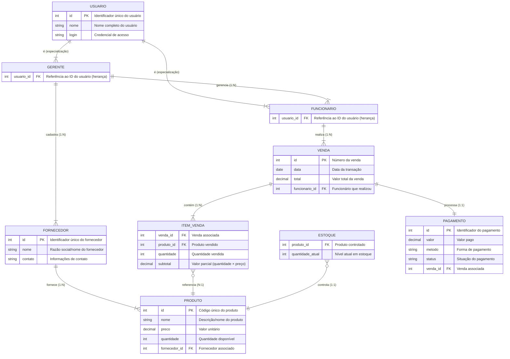

# Sistema de Controle de Estoque para Ótica  

## Descrição do Projeto  
O sistema de controle de estoque para ótica tem como objetivo otimizar a gestão do estoque, controlando a entrada e saída de produtos (armações, lentes, óculos de sol). Oferece:  

- **Controle em tempo real** do estoque  
- **Registro de vendas** e transações  
- **Relatórios detalhados**  
- **Acesso seguro** por perfil de usuário  
- **Interface intuitiva**  

## Equipe  

| Membro            | Papel                   | E-mail                          |
|-------------------|-------------------------|---------------------------------|
| Cayo César        | Analista                | cayo.lopes.129@ufrn.edu.br      |
| Gabriel Gomes     | Analista                | gabriel.gomes.710@ufrn.edu.br   |
| Gustavo Douglas   | Líder Técnico           | gustavo.cruz.133@ufrn.edu.br    |
| Joyce Oliveira    | Analista                | joyce.santos.709@ufrn.edu.br    |
| Taciano Silva     | Cliente/Professor       | tacianosilva@gmail.com          |
| Arthur            | Cliente                 | stegelemon.com.br@gmail.com     |

## Perfis de Usuários  

### Funcionário  
- Visualizar estoque  
- Registrar vendas  
- Emitir comprovantes  

### Gerente  
- Gerenciar produtos, funcionários e fornecedores  
- Acessar relatórios  
- Controlar permissões  

## Requisitos Funcionais

## Entidade Funcionário - US01 - Manter Funcionário

Um funcionário possui nome, cargo e informações de contato.

| Requisito  | Descrição                                                                                          | Ator          |
|------------|----------------------------------------------------------------------------------------------------|--------------|
| RF01.01 - Inserir Funcionário | Insere novo funcionário informando: nome, cargo e contato.                           | Gerente      |
| RF01.02 - Listar Funcionários | Listagem dos funcionários utilizando filtros nos atributos: nome, cargo e contato. | Gerente      |
| RF01.03 - Atualizar Funcionário | Atualiza um funcionário informando: nome, cargo e contato.                         | Gerente      |
| RF01.04 - Deletar Funcionário | Deleta um funcionário informando o identificador único.                           | Gerente      |

---

## Entidade Fornecedor - US02 - Manter Fornecedor

Um fornecedor possui nome e informações de contato.

| Requisito  | Descrição                                                                                   | Ator          |
|------------|---------------------------------------------------------------------------------------------|--------------|
| RF02.01 - Inserir Fornecedor | Insere novo fornecedor informando: nome e contato.                           | Gerente      |
| RF02.02 - Listar Fornecedores | Listagem de fornecedores utilizando filtros nos atributos: nome e contato.    | Gerente      |
| RF02.03 - Atualizar Fornecedor | Atualiza um fornecedor informando: nome e contato.                          | Gerente      |
| RF02.04 - Deletar Fornecedor | Deleta um fornecedor informando o identificador único.                      | Gerente      |

---

## Entidade Produto - US03 - Manter Produto

Um produto possui nome, preço e quantidade em estoque.

| Requisito  | Descrição                                                                                           | Ator          |
|------------|-----------------------------------------------------------------------------------------------------|--------------|
| RF03.01 - Inserir Produto | Insere novo produto informando: nome, preço e quantidade em estoque.                    | Gerente      |
| RF03.02 - Listar Produtos | Listagem de produtos utilizando filtros nos atributos: nome, preço e quantidade.       | Gerente      |
| RF03.03 - Atualizar Produto | Atualiza um produto informando: nome, preço e quantidade.                            | Gerente      |
| RF03.04 - Deletar Produto | Deleta um produto informando o identificador único.                                  | Gerente      |

---

## Entidade Venda - US04 - Realizar Venda

Uma venda consiste na compra de produtos e pagamento pelo cliente.

| Requisito  | Descrição                                                                                           | Ator          |
|------------|-----------------------------------------------------------------------------------------------------|--------------|
| RF04.01 - Registrar Venda | O sistema deve permitir registrar a venda de produtos e atualizar automaticamente o estoque. | Funcionário  |
| RF04.02 - Emitir Comprovante | O sistema deve permitir emitir um comprovante da venda para o cliente.              | Funcionário  |
| RF04.03 - Consultar Histórico de Vendas | O sistema deve permitir visualizar o histórico de vendas por data, cliente ou produto. | Gerente      |

---

## Requisitos Não Funcionais

| Código  | Requisito       | Descrição                                                                                 | Prioridade   |
|---------|----------------|-------------------------------------------------------------------------------------------|--------------|
| RNF01   | Desempenho     | O sistema deve processar transações e atualizar o estoque em tempo real.                  | Essencial    |
| RNF02   | Segurança      | O sistema deve ter autenticação de usuários e controle de permissões de acesso.           | Essencial    |
| RNF03   | Usabilidade    | O sistema deve ser intuitivo e fácil de usar, com suporte a funcionalidades acessíveis.  | Importante   |
| RNF04   | Confiabilidade | O sistema deve estar disponível durante o horário de funcionamento e possuir backups.     | Essencial    |

---

### Modelo Conceitual

Abaixo apresentamos o modelo conceitual usando o **Mermaid**.

# Principais Características do Modelo Conceitual

## 1. Estrutura de Usuários
- **Herança (Specialização/Generalização)**:
  - `USUARIO` como entidade pai (superclasse)
  - `GERENTE` e `FUNCIONARIO` como entidades filhas (subclasses)
  - Implementado via chave estrangeira (`usuario_id`)

## 2. Relacionamentos Hierárquicos
- **Gerência**:
  - `GERENTE` → `FUNCIONARIO` (1:N)
- **Cadastro**:
  - `GERENTE` → `FORNECEDOR` (1:N)

## 3. Cadeia de Suprimentos
- **Fornecimento**:
  - `FORNECEDOR` → `PRODUTO` (1:N)
- **Controle de Estoque**:
  - `ESTOQUE` → `PRODUTO` (1:1)

## 4. Processo de Vendas
- **Operacional**:
  - `FUNCIONARIO` → `VENDA` (1:N)
- **Composição**:
  - `VENDA` → `ITEM_VENDA` (1:N)
  - `ITEM_VENDA` → `PRODUTO` (N:1)

## 5. Transações Financeiras
- **Pagamento**:
  - `VENDA` → `PAGAMENTO` (1:1)

## 6. Atributos e Identificadores
| Entidade       | PK    | Atributos Relevantes               | FK              |
|----------------|-------|------------------------------------|-----------------|
| USUARIO        | id    | nome, login                        | -               |
| GERENTE        | -     | -                                  | usuario_id      |
| FUNCIONARIO    | -     | -                                  | usuario_id      |
| FORNECEDOR     | id    | nome, contato                      | -               |
| PRODUTO        | id    | nome, preço, quantidade            | fornecedor_id   |
| ESTOQUE        | -     | quantidade_atual                   | produto_id      |
| VENDA          | id    | data, total                        | funcionario_id  |
| ITEM_VENDA     | -     | quantidade, subtotal               | venda_id, produto_id |
| PAGAMENTO      | id    | valor, método, status              | venda_id        |

## 7. Integridade e Normalização
- **Chaves Primárias**: Todas as entidades possuem identificadores únicos
- **Chaves Estrangeiras**: Todos os relacionamentos são devidamente implementados
- **Cardinalidades**: Especificadas corretamente para cada relacionamento
- **Ausência de Redundância**: Dados não duplicados entre entidades

## 8. Tipos de Dados
- **Numéricos**: `int` para IDs e quantidades, `decimal` para valores monetários
- **Textuais**: `string` para nomes e descrições
- **Temporais**: `date` para registro de datas

## 9. Modelagem de Negócios
- **Controle de Acesso**: Distinção clara entre gerentes e funcionários
- **Gestão de Inventário**: Controle de estoque vinculado a produtos
- **Processo Completo de Venda**: Desde o cadastro até o pagamento

### Modelo de Entidade Relacionamento ER

# Principais Características do Modelo Entidade-Relacionamento (MER)

## Estrutura Básica
- **Entidades Principais**: USUARIO, GERENTE, FUNCIONARIO, FORNECEDOR, PRODUTO, VENDA, ITEM_VENDA, PAGAMENTO, ESTOQUE  
- **Relacionamentos**: Especialização (herança), associações 1:N e N:1, composição (Venda-Itens)  
- **Cardinalidades**: Claramente definidas (ex: 1:1, 1:N, N:1)  

---

## Chaves e Identificadores
- **PK (Primary Key)**: Todas as entidades possuem ID único (ex: `USUARIO.id`, `VENDA.id`)  
- **FK (Foreign Key)**: Relacionamentos implementados via chaves estrangeiras (ex: `FUNCIONARIO.usuario_id` referencia `USUARIO.id`)  

---

## Hierarquia e Herança
- **Generalização (USUARIO)**:  
  - Especializações: `GERENTE` e `FUNCIONARIO` herdam atributos de `USUARIO` via FK.  
- **Papéis Distintos**:  
  - Gerente: Gerencia funcionários e cadastra fornecedores.  
  - Funcionário: Realiza vendas.  

---

## Fluxo de Vendas
1. **VENDA**:  
   - Realizada por `FUNCIONARIO`.  
   - Contém múltiplos `ITEM_VENDA` (com quantidade e subtotal).  
2. **PRODUTO**:  
   - Vinculado a `FORNECEDOR` e `ESTOQUE`.  
   - Referenciado em `ITEM_VENDA`.  
3. **PAGAMENTO**:  
   - Relação 1:1 com `VENDA` (valor, método, status).  

---

## Gestão de Estoque e Fornecedores
- **FORNECEDOR**: Cadastrado por `GERENTE`, fornece `PRODUTO`.  
- **ESTOQUE**: Monitora `quantidade_atual` por produto (relação 1:1 com `PRODUTO`).  

---

## Integridade Referencial
- **Dependências**:  
  - Exclusão de `USUARIO` deve afetar `GERENTE`/`FUNCIONARIO`.  
  - `ITEM_VENDA` depende de `VENDA` e `PRODUTO`.  
- **Atributos Obrigatórios**:  
  - Todos os IDs (PK/FK) são `NOT NULL`.  

---

## Tipos de Dados
- **Numéricos**: IDs (`int`), quantidades (`int`), valores monetários (`decimal`).  
- **Textos**: Nomes (`string`), método de pagamento (`string`).  
- **Datas**: `VENDA.data` como `date`.  

### Destaques:
- **Performance**: Relações otimizadas (ex: estoque 1:1 com produto).  
- **Segurança**: Herança garante controle de acesso (gerente vs funcionário).  
- **Escalabilidade**: Modelo suporta crescimento (ex: múltiplos itens por venda).  
  
